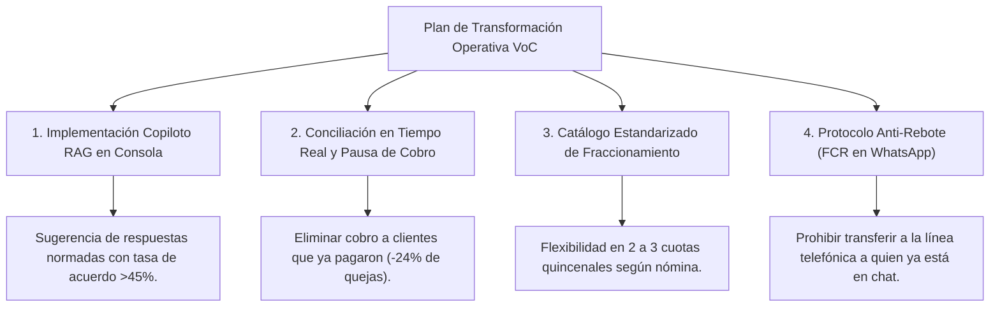

# Presentación Ejecutiva - Proyecto Voice of Customer (VoC), NLP, IA Generativa & Analítica Conversacional

## 📌 Ficha Técnica del Proyecto
- **Origen de Datos**: `Base sintetica conversaciones.xlsx` — Base suministrada y anonimizada/sintética con **42,607 interacciones** distribuidas en **1,197 conversaciones únicas** de WhatsApp de cobranza bancaria.
- **Entorno de Procesamiento**: Python 3.14, Pandas, Scikit-Learn, Seaborn/Matplotlib, Plotly, Streamlit, JSON Schema LLM Prompts, RAG Architecture.
- **Modelos de IA Empleados**: Arquitectura multi-modelo resiliente liderada por **Ollama Cloud (Gemma 4 31B Cloud)** con balanceo y fallbacks a **Groq (GPT-OSS / Qwen)** y **Google Gemini (Gemini 3.5 Flash Lite)**.
- **Métricas Oficiales Consolidadas**:
  - **Tasa Global de Acuerdo (Agreement Rate)**: **31.41%** (376 acuerdos formales bajo criterio estricto: intención explícita + fecha específica).
  - **CSAT Observado (Encuesta Declarada 1 a 7)**: **5.43 / 7** (235 clientes encuestados, 19.6% cobertura).
  - **Score de Satisfacción Estimado por IA (0 a 100)**: **52.8 / 100** a nivel poblacional.

---

## 1. Respuesta a las Preguntas de Negocio

### 🔍 Pregunta A: ¿Cuáles son los principales motivos de no pago?
A través de procesamiento semántico con LLM (extrayendo causas exclusivamente de mensajes emitidos por el cliente y descartando plantillas del asesor o bot):

| Causa / Motivo de No Pago | Frecuencia | % del Total | Caracterización de Negocio |
|---|---|---|---|
| **1. Falta de liquidez** | 293 | **24.48%** | Retrasos en pago de salario, iliquidez transitoria a fin de mes o descalce de flujo de caja. |
| **2. Pago ya realizado** | 289 | **24.14%** | Fricción operativa severa: clientes que pagaron en los últimos 1-3 días pero el pago no se refleja por desfase en la conciliación bancaria. |
| **3. Disputa de saldo o cobro** | 280 | **23.39%** | Inconformidad con el valor de la cuota, incremento de intereses o cobro de seguros no contratados. |
| **4. Consulta o trámite** | 192 | **16.04%** | Clientes que preguntan por saldo al día, certificados de paz y salvo o medios de pago alternativos. |
| **5. Desconexión o rebote** | 137 | **11.45%** | Sesiones cerradas por inactividad o clientes remitidos reiteradamente a otros canales sin solución. |
| **6. Desempleo** | 108 | **9.02%** | Pérdida de empleo formal o cese de ingresos independientes. |
| **7. Priorización otros gastos** | 54 | **4.51%** | El cliente prioriza gastos de alimentación, arriendo, servicios públicos o matrículas educativas. |
| **8. Emergencia familiar / Salud**| 63 | **5.26%** | Gastos imprevistos de hospitalización, medicamentos o calamidad doméstica. |

> 💡 **Hallazgo Estratégico**: El **47.5%** de los contactos corresponden a **Cobro de lo Indebido** (`pago_ya_realizado`) y **Disputas de Saldo**. Esto demuestra que la operación está desgastando capacidad operativa en cobrarle a clientes que no están en mora intencional, sino que son víctimas de desfases de sistemas contables.

---

### 💼 Pregunta B: ¿Qué ofertas realizan los asesores para lograr un acuerdo de pago?
Las alternativas presentadas por los asesores se distribuyen de la siguiente manera:

1. **Extensión de plazo (17.04% / 204 gestiones)**: Otorgamiento de entre 5 y 15 días adicionales para realizar el pago.
2. **Refinanciación (13.20% / 158 gestiones)**: Reestructuración de la deuda total en nuevo plazo.
3. **Fraccionamiento de cuota (11.36% / 136 gestiones)**: División de la cuota vencida en 2 o 3 pagos quincenales.
4. **Derivación a mesa de reclamos (4.68% / 56 gestiones)**: Remisión a canales especializados.
5. **Descuento comercial (1.09% / 13 gestiones)**: Condonación de porcentaje de capital para pago total.
6. **Condonación de intereses moratorios (0.84% / 10 gestiones)**: Perdón exclusivo de cargos por mora.

---

### 📈 Pregunta C: ¿Qué ofrecimientos o argumentos logran más acuerdos de pago?

#### Ranking de Efectividad de Ofertas:
| Oferta | Gestiones | Acuerdos Logrados | Tasa de Efectividad (% Agreement Rate) |
|---|---|---|---|
| **1. Fraccionamiento en cuotas** | 136 | 64 | **47.06%** 🏆 |
| **2. Extensión de plazo** | 204 | 91 | **44.61%** |
| **3. Condonación de intereses** | 10 | 4 | **40.00%** |
| **4. Descuento comercial** | 13 | 5 | **38.46%** |
| **5. Refinanciación integral** | 158 | 56 | **35.44%** |
| **6. Derivación a reclamos** | 56 | 8 | **14.29%** |

#### Ranking de Efectividad de Argumentos / Tácticas:
| Argumento / Táctica | Conversaciones | Acuerdos Logrados | Tasa de Efectividad (% Agreement Rate) |
|---|---|---|---|
| **1. Evitar gastos adicionales** | 176 | 85 | **48.30%** 🏆 |
| **2. Evitar reporte a centrales** | 308 | 142 | **46.10%** |
| **3. Empatía y acompañamiento** | 194 | 81 | **41.75%** |
| **4. Beneficio de pago inmediato**| 92 | 34 | **36.96%** |

> 🎯 **Insight Clave**: El argumento de **"Evitar gastos adicionales de cobranza/judicial"** supera al argumento del reporte negativo. Los clientes responden con mayor predisposición cuando comprenden el ahorro financiero inmediato y se les brinda una alternativa de **Fraccionamiento** ajustada a su flujo de ingresos.

---

### 📑 Pregunta D: ¿Qué está pasando en las conversaciones? (Resumen de cada llamada)
Cada una de las 1,197 conversaciones cuenta con un resumen estructurado generado por el LLM siguiendo el formato estándar de negocio: `Contexto inicial | Objeción del cliente | Alternativa planteada | Resultado final`.

*Todos los resúmenes se encuentran compilados y disponibles en el entregable:*
👉 [`outputs/resumen_conversaciones.csv`](file:///c:/Users/ADMIN/Pictures/Proyecto-Voice-of-Customer-VoC-NLP-IA-Generativa-y-Anal-tica-Conversacional/outputs/resumen_conversaciones.csv)

---

### ⚠️ Pregunta E: Características de las conversaciones con menor satisfacción (Top 5)

Para garantizar rigor metodológico, separamos claramente:
- **Ranking 1 (CSAT Observado en Encuesta Real 1 a 7)**: Clientes que calificaron con notas mínimas (0 o 1).
- **Ranking 2 (Score de Satisfacción Estimado por IA 0 a 100)**: Evaluado algorítmicamente según fricción y riesgo.

#### Casos Críticos Analizados (CSAT = 0/1):

1. **`CONV_00000018`** (CSAT: 0/7 | Score: 0/100 | Tono: Indignado)
   - **Diagnóstico**: El cliente solicitó reiteradamente que dejaran de enviarle cobros porque ya había pagado. El asesor no pudo validar el pago en línea e insistió en exigir la consignación.
   - **Factor de Fricción**: Cobro indebido a cliente al día por falta de conciliación bancaria en tiempo real.
   - **Recomendación**: Suspender la cobranza de inmediato y validar en el módulo de recaudos en menos de 24h.

2. **`CONV_00000042`** (CSAT: 0/7 | Score: 0/100 | Tono: Frustrado)
   - **Diagnóstico**: Acuerdo de pago cancelado unilateralmente por el sistema bancario sin notificar al titular. El asesor no brindó solución ni reactivó el beneficio.
   - **Factor de Fricción**: Falla de trazabilidad en sistemas core y falta de facultades resolutivas del asesor.
   - **Recomendación**: Facultar al gestor para reactivar acuerdos y emitir confirmación inmediata por WhatsApp.

3. **`CONV_00000062`** (CSAT: 0/7 | Score: 0/100 | Tono: Frustrado)
   - **Diagnóstico**: Crédito con descuento por nómina. La empresa del cliente descontó el valor, pero el banco reporta mora. El asesor no gestionó con la mesa de nóminas.
   - **Factor de Fricción**: Descoordinación entre recaudo empresarial de nómina y la cartera de cobranza.
   - **Recomendación**: Enlace automático entre cobranza y convenios de libranza empresarial.

4. **`CONV_00000083`** (CSAT: 0/7 | Score: 0/100 | Tono: Indignado)
   - **Diagnóstico**: El cliente objeta un incremento desmedido en la cuota mensual. Pide reestructuración y el asesor responde con respuestas genéricas y rígidas.
   - **Factor de Fricción**: Asesor sin empatía y ausencia de simulación de cuotas en tiempo real.
   - **Recomendación**: Implementar el Copiloto RAG para calcular y proponer inmediatamente cuotas fraccionadas.

5. **`CONV_00000089`** (CSAT: 0/7 | Score: 0/100 | Tono: Indignado)
   - **Diagnóstico**: Cobro enviado a un teléfono empresarial que no corresponde al titular de la deuda.
   - **Factor de Fricción**: Datos de contacto desactualizados y violación de privacidad de datos (Habeas Data).
   - **Recomendación**: Filtro estricto de autenticación previo al envío de mensajes de cobranza.

---

## 2. Recomendaciones Estratégicas de Negocio



1. **Despliegue del Copiloto RAG para Asesores**:
   - Sugerir en la pantalla del asesor la combinación óptima comprobada: **Fraccionamiento + Argumento de Ahorro de Gastos** (tasa de conversión esperada: **47-48%**).
2. **Pausa Automática por Pago en Tránsito (Anti-Detracción)**:
   - Si el cliente menciona `ya pagué` o adjunta soporte, el bot de WhatsApp debe pausar la cobranza por 48 horas automáticamente.
3. **Mesa Técnica de Resolución Rápida de Disputas**:
   - Crear una cola de atención prioritaria para las 280 conversaciones con disputas de saldo, evitando que el caso escale a la Superintendencia.

---

## 3. Modelo de Datos y Medidas DAX para Power BI

### Star Schema Recomendado:
- **`Fact_Conversaciones`**: `conversation_id`, `fecha_gestion`, `total_mensajes`, `acuerdo_pago`, `score_satisfaccion`, `csat_declarado`, `requiere_escalamiento`, `id_motivo_principal`.
- **`Dim_Motivos`**: `id_motivo`, `motivo_nombre`, `categoria_riesgo`.
- **`Dim_Ofertas`**: `id_oferta`, `tipo_oferta`, `plazo_maximo`.
- **`Dim_Asesores`**: `id_asesor`, `equipo_cobranza`, `supervisor`.

### Medidas DAX Clave:
```dax
// 1. Tasa de Acuerdo Estricta (% Agreement Rate)
Tasa_Acuerdos = 
DIVIDE(
    CALCULATE(COUNTROWS(Fact_Conversaciones), Fact_Conversaciones[acuerdo_pago] = 1),
    COUNTROWS(Fact_Conversaciones),
    0
)

// 2. CSAT Observado Promedio (Escala 1 a 7)
CSAT_Observado_Promedio = 
AVERAGE(Fact_Conversaciones[csat_declarado])

// 3. Índice de Fricción Operativa (% Pagos Realizados y Disputas)
Indice_Friccion_Cobro = 
DIVIDE(
    CALCULATE(
        COUNTROWS(Fact_Conversaciones),
        Fact_Conversaciones[motivo] IN {"pago_ya_realizado", "disputa_saldo_o_cobro"}
    ),
    COUNTROWS(Fact_Conversaciones),
    0
)
```
