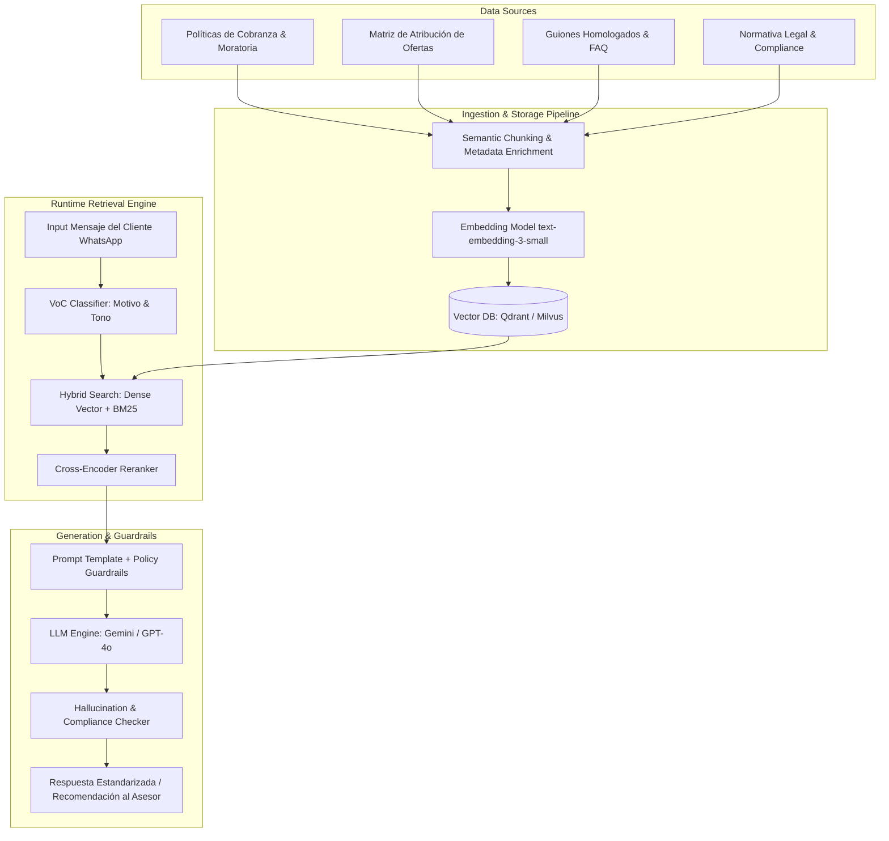
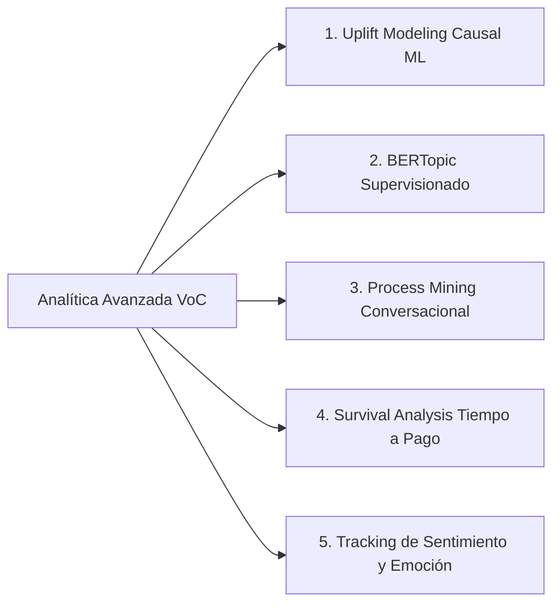

# Propuesta Arquitectónica RAG para Estandarización de Respuestas en Cobranzas por WhatsApp

## 1. Resumen Ejecutivo y Diagnóstico del Problema

En las operaciones de cobranza por WhatsApp, la falta de estandarización en las respuestas de los asesores genera tres problemas críticos:
1. **Ineficiencia en la Negociación**: Los asesores aplican ofertas de forma empírica o imprecisa, perdiendo la oportunidad de cerrar acuerdos de pago con fechas concretas.
2. **Riesgo Regulatorio y Operativo**: Uso eventual de lenguaje confrontativo, promesas fuera de política o amenazas desmedidas que afectan la reputación institucional y generan reclamos ante entes reguladores (e.g., Indecopi, Superintendencia).
3. **Fricción en la Experiencia del Cliente (CX)**: Incapacidad de ofrecer alternativas adaptadas al motivo específico de no pago expuesto por el cliente (desempleo, liquidez, enfermedad, disputa de cobro).

Para solucionar este desafío, se propone un sistema de **Generación Aumentada por Recuperación (RAG)** estructurado como **Copiloto de Cobranza en Tiempo Real**.

---

## 2. Componentes de la Arquitectura RAG



### 2.1. Base de Conocimiento Curada (Knowledge Base)
- **Políticas Institucionales**: Reglas de refinanciación, tramos de mora, límites de descuento permitidos según días de mora (30, 60, 90+ días).
- **Matriz de Atribución de Ofertas**: Mapeo estricto entre motivo manifestado y alternativas aprobadas:
  - *Desempleo* $\rightarrow$ Periodo de gracia + Refinanciación a menor cuota.
  - *Falta de Liquidez* $\rightarrow$ Fraccionamiento en cuotas fijas sin penalidad.
  - *Problemas de Salud* $\rightarrow$ Extensión de plazo + Condonación de mora.
  - *Disputa de Deuda* $\rightarrow$ Suspensión de gestión y derivación a Mesa de Validación.
- **Guiones Homologados**: Lenguaje empático, no confrontativo, orientado al cierre con compromiso de fecha.

### 2.2. Pipeline de Ingestión y Chunking Semántico
- **Chunking orientado a Reglas**: Fragmentación por artículo/política (250 a 400 tokens con overlap del 15%).
- **Enriquecimiento de Metadatos**: Cada chunk almacena metadatos clave: `{motivo_asociado, tramo_mora, segmento_producto, vigencia_legal, canal}`.
- **Indexación Vectorial**: Embeddings de alta dimensión (`text-embedding-3-small` / `BGE-M3`) almacenados en Vector Database (Qdrant / Milvus).

### 2.3. Motor de Búsqueda Híbrida y Reranking
- **Búsqueda Híbrida (Hybrid Search)**: Combina búsqueda vectorial densa (similitud del contexto del cliente) con BM25 Sparse Search (coincidencia de términos normativos exactos).
- **Reranking con Cross-Encoder**: Un modelo reranker (`bge-reranker-large`) selecciona los 3 mejores fragmentos con mayor relevancia contextual e institucional.

### 2.4. Generación Controlada y Guardrails
- **Prompting Estricto**: Inserción de guardrails de cumplimiento que prohíben explícitamente:
  - Mencionar plazos inferiores a los legales.
  - Emplear amenazas o calificativos peyorativos.
  - Prometer descuentos superiores a los autorizados en la base de conocimiento.
- **Hallucination & Compliance Checker**: Validador de salida previo al envío que verifica que la respuesta contenga citas de política y cumpla con el formato estándar.

---

## 3. Plantilla de Prompt con Guardrails para el Copiloto RAG

```yaml
System Prompt:
Eres el Copiloto Inteligente de Cobranza Ética y Resolutiva del Banco. Tu objetivo es asesorar al gestor para responder al cliente de forma altamente empática, legalmente impecable y orientada a cerrar un compromiso explícito de pago con fecha.

Instrucciones de Negociación:
1. Reconoce y valida el motivo de no pago expresado por el cliente con empatía genuina.
2. Utiliza ÚNICAMENTE la información retrieved en los fragmentos del contexto para proponer alternativas financieras.
3. Si el cliente plantea una disputa o reclamo por cobro no reconocido, NO INSISTAS EN EL PAGO; propone la verificación en la Mesa de Reclamos.
4. Toda oferta debe cerrar con una pregunta directa solicitando una fecha específica de pago.

Restricciones de Cumplimiento (Guardrails):
- NUNCA uses lenguaje confrontativo o intimidador.
- NUNCA garantices condonaciones mayores a las estipuladas en el contexto.
- SIEMPRE requiere confirmación de fecha exacta (DD/MM/AAAA).

Contexto Recuperado (RAG Chunks):
{retrieved_chunks}

Historial de la Conversación:
{conversation_history}

Mensaje del Cliente:
{client_latest_message}

Respuesta Sugerida (JSON):
{
  "respuesta_sugerida": "texto empático y resolutivo para WhatsApp",
  "oferta_aplicada": "descuento | fraccionamiento | extension | refinanciacion",
  "pregunta_cierre": "¿Podría confirmar si realiza el abono el día DD/MM/AAAA?",
  "cumplimiento_politica": true
}
```

---

## 4. Criterios y Métricas de Evaluación del Sistema RAG

| Categoría | Métrica | Definición / Fórmula | Objetivo |
| :--- | :--- | :--- | :--- |
| **Calidad RAG** | **Faithfulness (Fidelidad)** | Porcentaje de afirmaciones de la respuesta respaldas por los chunks recuperados. | $>98\%$ |
| **Calidad RAG** | **Answer Relevance** | Relevancia semántica entre la duda/motivo del cliente y la respuesta generada. | $>0.90$ (COS) |
| **Cumplimiento** | **Policy Compliance Rate** | % de respuestas auditadas que cumplen 100% de la normativa legal sin guardrail violations. | $100\%$ |
| **Negocio** | **Post-RAG Agreement Uplift** | Incremento porcentual en acuerdos de pago logrados tras implementar RAG. | $+15\% \text{ a } +25\%$ |
| **Experiencia (CX)**| **CSAT Conversacional** | Calificación promedio otorgada por los clientes post-interacción. | $>85 / 100$ |
| **Riesgo** | **Hallucination Rate** | Frecuencia de generación de datos inventados o promesas no autorizadas. | $<0.01\%$ |
| **Técnico** | **Latencia P95** | Tiempo total de respuesta desde el mensaje del cliente hasta la recomendación. | $<1.2 \text{ segundos}$ |

---

## 5. Otras Metodologías Analíticas Avanzadas Propuestas

Para abordar la problemática general de cobranza de forma integral, se proponen 5 metodologías complementarias de analítica avanzada e IA:



### 5.1. Uplift Modeling (Causal Machine Learning)
- **Problema**: Aplicar descuentos o refinanciaciones a todos los clientes reduce el margen financiero innecesariamente en aquellos clientes que pagarían con un simple recordatorio ("Persuadables" vs "Sure Things").
- **Metodología**: Entrenar modelos de bosque causal o *T-Learner / X-Learner* para estimar el **Efecto Causal Individual del Tratamiento (ITE)**:
  $$\tau_i = E[Y_i(1) - Y_i(0) | X_i]$$
  donde $Y_i(1)$ es el acuerdo con oferta y $Y_i(0)$ sin oferta. Permite priorizar descuentos solo en clientes con alto Uplift.

### 5.2. Supervised & Unsupervised Topic Modeling (BERTopic)
- **Problema**: Las taxonomías estáticas pierden de vista nuevas razones emergentes de no pago.
- **Metodología**: Utilizar embeddings de lenguaje (`sentence-transformers`) con reducción UMAP y clustering HDBSCAN para descubrir tópicos latentes y fricciones de producto (e.g., fallas en la App, problemas de billeteras digitales, demoras en transferencias interbancarias).

### 5.3. Análisis Secuencial de Diálogo (Process Mining en NLU)
- **Problema**: Se desconoce la secuencia exacta de turnos que genera el cierre exitoso.
- **Metodología**: Mapear la conversación como una cadena de Markov o grafo de estados conversacionales (`[Saludo] -> [Diagnóstico Motivo] -> [Oferta Empática] -> [Manejo de Objeción] -> [Cierre Fecha]`). Identificar los caminos críticos que maximizan la probabilidad de transición al estado "Acuerdo Exitoso".

### 5.4. Análisis de Supervivencia (Survival Analysis - Cox Proportional Hazards)
- **Problema**: El indicador binario de acuerdo no refleja la velocidad de recuperación real del dinero.
- **Metodología**: Modelar el tiempo transcurrido (días) desde el contacto hasta el abono efectivo mediante curvas de Kaplan-Meier y regresión de riesgos proporcionales de Cox:
  $$h(t | X) = h_0(t) \exp(\beta_1 X_1 + \beta_2 X_2 + \dots + \beta_p X_p)$$
  Evaluando el impacto de cada táctica en la reducción del *Time-to-Payment*.

### 5.5. Tracking de Traectoria de Sentimiento y Emoción
- **Problema**: Detectar en qué turno exacto la interacción se deteriora o se rescata.
- **Metodología**: Extraer en cada turno del cliente indicadores de valencia emocional (Ansiedad, Frustración, Neutralidad, Colaboración). Calcular la **Velocidad Emocional** ($\Delta \text{Sentimiento} / \Delta \text{Turno}$) para activar alertas de supervisión en tiempo real ante caídas abruptas.
