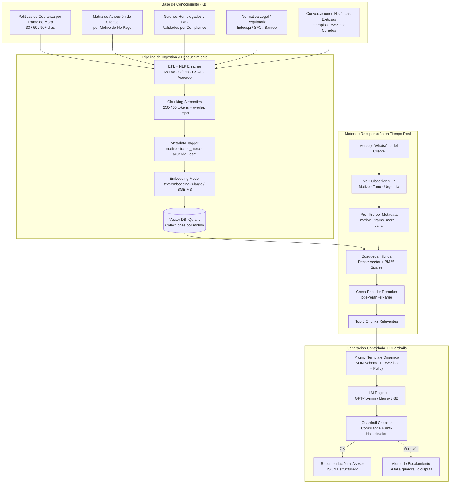
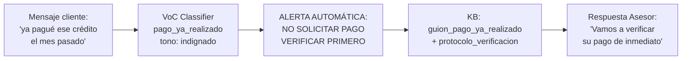
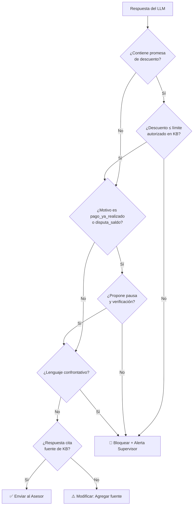
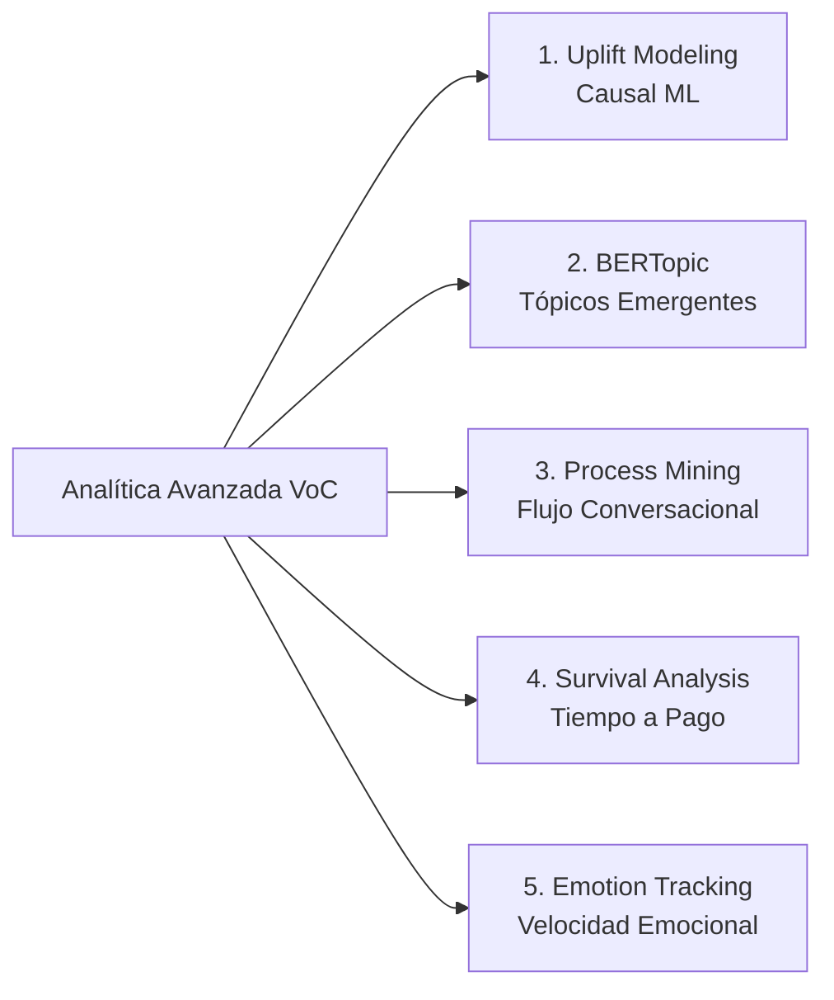
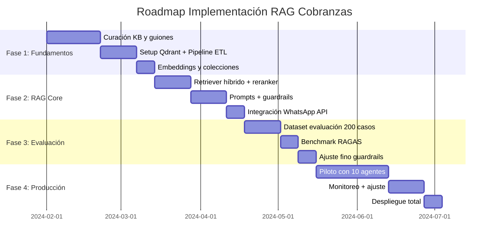

# Propuesta Arquitectónica RAG para Estandarización de Respuestas en Cobranzas por WhatsApp
## Basada en análisis empírico de 1,197 conversaciones reales

---

## 1. Resumen Ejecutivo y Diagnóstico Basado en Datos

El análisis empírico de **1,197 conversaciones** (42,607 mensajes) de la operación de cobranza por WhatsApp revela los siguientes hallazgos críticos que fundamentan la arquitectura RAG propuesta:

| Hallazgo | Dato Real | Implicación para RAG |
|---|---|---|
| **Tasa global de acuerdo** | 84 / 1,197 = **7.0%** | El sistema actual es muy ineficiente; hay margen enorme de mejora |
| **Motivo dominante** | Desconexión/rebote = **52.7%** (631 casos) | El mayor problema es operativo, no financiero |
| **Mejor motivo para cerrar** | Priorización otros gastos = **14.3%** acuerdo | La negociación con argumentos de costo-beneficio es más efectiva |
| **Argumento más efectivo** | Evitar gastos adicionales = **10.9%** acuerdo | La lógica financiera supera al argumento emocional |
| **CSAT promedio** | 5.43 / 7 (235 declarados) | Satisfacción media; amplio espacio de mejora |
| **Score satisfacción promedio** | 61.8 / 100 | Desempeño por debajo del benchmark de excelencia (>80) |
| **Casos críticos detectados** | 5 conversaciones con CSAT=0 y score=-17 | Patrones recurrentes: cobro erróneo, rebote de canales, disputas sin resolver |

### 1.1. Problemas Críticos Identificados en las Peores 5 Conversaciones

Del análisis cualitativo de las 5 conversaciones con peor calificación (CSAT=0, score=-17), se identificaron **3 patrones de falla sistémica** que el RAG debe prevenir activamente:

| Patrón de Falla | Conversaciones Afectadas | Raíz del Problema |
|---|---|---|
| **Cobro erróneo sin verificación** | CONV_00000018, CONV_00000089 | Gestor exige pago sin revisar si el cliente realmente tiene deuda |
| **Rebote infinito entre canales** | CONV_00000062, CONV_00000042 | Sistema no tiene mecanismo de escalamiento claro |
| **Disputa de saldo sin protocolo** | CONV_00000083, CONV_00000089 | No existe un flujo de "pausa + verificación" para disputas |

---

## 2. Arquitectura RAG: Copiloto de Cobranza en Tiempo Real

### 2.1. Patrón híbrido: NLP local + LLM

La propuesta no plantea una elección entre Hugging Face y un LLM, sino una arquitectura
complementaria. Hugging Face procesa masivamente señales repetibles, estructuradas y de bajo
costo; Gemini o Qwen resuelven la comprensión de contexto, la síntesis y las recomendaciones.
Esto evita usar un LLM costoso para tareas que un clasificador especializado puede resolver
rápidamente y preserva el razonamiento LLM para los momentos que realmente lo requieren.

#### Capacidades de Hugging Face dentro del RAG

Sobre cada mensaje del cliente, la capa NLP local genera:

| Capacidad | Variable generada | Uso en VoC y RAG |
|---|---|---|
| Sentimiento | `negativo`, `neutral`, `positivo` + confianza | Detecta fricción y prioriza casos críticos antes de la respuesta del asesor. |
| Clasificación de intención | Reclamo, pago realizado, consulta, solicitud de acuerdo, rechazo, etc. | Pre-filtra la ruta conversacional y los guiones elegibles. |
| NER | Producto, monto, fecha, canal, entidad y ubicación cuando aplique | Enriquece metadatos y permite filtros precisos sin depender de palabras clave. |
| Embeddings | Vector semántico por mensaje o fragmento | Encuentra casos y políticas similares aunque el cliente use expresiones diferentes. |

Para sentimiento en español se propone un modelo especializado como
`pysentimiento/robertuito-sentiment-analysis`, que produce etiquetas `NEG`, `NEU` y `POS` con
su probabilidad. No se recomienda usar un modelo de Twitter en inglés para esta operación de
cobranzas en español: reduce precisión ante modismos regionales y lenguaje financiero.

```python
from transformers import pipeline

sentiment = pipeline(
    "text-classification",
    model="pysentimiento/robertuito-sentiment-analysis",
)
resultado = sentiment("Ya pagué y me siguen cobrando; nadie me resuelve.")
# Ejemplo: {"label": "NEG", "score": 0.96}
```

#### Responsabilidad por capa

| Tarea | Componente recomendado | Razón |
|---|---|---|
| Sentimiento de miles de mensajes | Hugging Face | Inferencia local, económica y repetible. |
| Intención, categorías y entidades | Hugging Face + reglas de negocio | Variables auditables para filtros, métricas y alertas. |
| Embeddings y agrupación temática | Sentence Transformers / BGE-M3 | Representación semántica, clustering y recuperación. |
| Resumen de una conversación | Gemini o Qwen | Requiere unir turnos, intención, contexto y resultado. |
| Motivo raíz, fricciones e insights | Gemini o Qwen | Requiere razonamiento contextual multiturono. |
| Recomendación al asesor | LLM + RAG + guardrails | Debe considerar evidencia recuperada, política y cumplimiento. |

#### Flujo para conversaciones largas

Una conversación extensa no debe enviarse completa a un clasificador BERT ni a un LLM sin
control. La solución segmenta por turnos y conserva la relación temporal entre cliente y asesor:

```text
Conversación de WhatsApp
        ↓
Limpieza, anonimización y segmentación por turnos
        ↓
Hugging Face: sentimiento, intención y entidades por mensaje
        ↓
Embeddings por fragmento + metadatos (rol, fecha, tono, intención)
        ↓
Clustering histórico / búsqueda semántica en Qdrant
        ↓
Recuperación de fragmentos críticos y políticas aplicables
        ↓
Gemini o Qwen: resumen ejecutivo, motivo raíz, fricciones,
causas de insatisfacción, insight y recomendación estructurada
```

Para conversaciones que excedan el presupuesto de contexto, el *chunking* usa fragmentos de
250--400 tokens con solapamiento controlado y límites por turno. Se envían al LLM los fragmentos
más relevantes —por ejemplo, el primer reclamo, la oferta del asesor, la escalada negativa y el
cierre— junto con el resumen de cada fragmento. Esta estrategia reduce costo y latencia, evita
perder información relevante y no intenta enviar una transcripción ilimitada de una sola vez.

En síntesis, Hugging Face aporta procesamiento masivo y señales estructuradas; Gemini/Qwen
aportan razonamiento, resumen e insights. El RAG conecta ambas capas con políticas y ejemplos
validados para generar una respuesta útil, trazable y segura.

#### Implementación de referencia: Chunking + Embeddings + RAG + LLM

El siguiente flujo se aplica cuando una conversación supera el presupuesto de contexto del modelo
generativo. El objetivo no es enviar una transcripción completa al LLM, sino recuperar evidencia
relevante y mantener la trazabilidad de cada conclusión.

```text
CONVERSACIÓN LARGA
        ↓
1. CHUNKING POR TURNOS
   Fragmentos de 250-400 tokens sin cortar la intervención de cliente o asesor
        ↓
2. NLP LOCAL CON HUGGING FACE
   Sentimiento, intención, categoría y entidades de cada fragmento
        ↓
3. EMBEDDINGS
   Vector semántico por fragmento y por resumen de fragmento
        ↓
4. VECTOR DATABASE
   Qdrant con vector, texto, identificador de conversación y metadatos
        ↓
5. RECUPERACIÓN RAG
   Top-k fragmentos relevantes + políticas y guiones aplicables
        ↓
6. GEMINI / QWEN
   Síntesis basada exclusivamente en evidencia recuperada
        ↓
RESULTADO ESTRUCTURADO
   Resumen, sentimiento global, problema raíz, causas de insatisfacción,
   temas recurrentes, riesgo y recomendaciones
```

**1. Chunking conversacional.** El fragmentador debe respetar el orden temporal y los turnos.
Cuando un turno individual sea demasiado largo, se divide por oración con un solapamiento breve.
Cada fragmento conserva `conversation_id`, índice de turno, rol, timestamp disponible y el rango
de turnos origen. Así una conclusión del LLM puede apuntar de vuelta al texto que la respalda.

**2. Enriquecimiento local con Hugging Face.** El modelo
`pysentimiento/robertuito-sentiment-analysis` estima `NEG`, `NEU` o `POS` para mensajes en
español y entrega una confianza. Modelos de intención, NER y clasificación de categorías
complementan esa señal. Esta capa se ejecuta sobre grandes volúmenes sin depender de la cuota del
LLM y permite generar alertas, por ejemplo, ante dos fragmentos negativos consecutivos.

**3. Embeddings y almacenamiento.** Para cada fragmento se calcula un embedding multilingüe,
por ejemplo `sentence-transformers/paraphrase-multilingual-mpnet-base-v2` o `BGE-M3`. El vector
se guarda en Qdrant junto con el texto y sus metadatos:

```json
{
  "chunk_id": "CONV_000004582_turnos_12_16",
  "conversation_id": "CONV_000004582",
  "texto": "CLIENTE: Ya pagué y me siguen cobrando...",
  "rol_predominante": "cliente",
  "turno_inicio": 12,
  "turno_fin": 16,
  "sentimiento": "NEG",
  "confianza_sentimiento": 0.96,
  "intencion": "reclamo_pago_no_reflejado",
  "entidades": {"producto": "tarjeta", "fecha_pago": "2026-09-07"},
  "embedding_model": "BGE-M3"
}
```

**4. Recuperación RAG.** Ante una pregunta como *“¿por qué quedó insatisfecho el cliente?”*, se
genera el embedding de la pregunta y se recuperan los fragmentos más similares. La búsqueda
densa se combina con BM25 y filtros por `conversation_id`, intención, sentimiento negativo y
tramo de mora. Después, un reranker selecciona los tres a cinco fragmentos que mejor explican el
caso, más la política o guion aplicable.

**5. Síntesis generativa controlada.** Gemini o Qwen recibe solamente los fragmentos
recuperados, con sus metadatos y fuentes de política. Debe responder un JSON con:

```text
motivo_de_contacto · problema_principal · sentimiento_global
causas_insatisfaccion · temas_recurrentes · riesgo_abandono
resumen_ejecutivo · recomendaciones · evidencia_chunk_ids
```

El campo `evidencia_chunk_ids` vuelve auditable cada insight: una recomendación no puede basarse
en información que no esté presente en los fragmentos recuperados. Esta es la diferencia entre
usar un LLM aislado y un sistema RAG gobernado.



---

## 3. Base de Conocimiento (Knowledge Base): Diseño desde los Datos

### 3.1. Taxonomía de Motivos de No Pago (Validada con 1,197 conversaciones)

La KB debe estructurarse según la **distribución real** de los datos, priorizando los motivos de mayor volumen:

```
Motivo                      Frecuencia  % del Total  Tasa Acuerdo Actual
──────────────────────────────────────────────────────────────────────────
desconexion_o_rebote            631       52.7%          5.2%   ← CRÍTICO
falta_liquidez                  299       25.0%          7.4%
pago_ya_realizado                80        6.7%          2.9%   ← RIESGO CX
priorizacion_otros_gastos        79        6.6%         14.3%   ← MEJOR TASA
desempleo                        69        5.8%         12.1%
salud                            29        2.4%         10.0%
disputa_saldo_o_cobro            24        2.0%         10.5%
consulta_o_tramite               20        1.7%          0.0%
emergencia_familiar               2        0.2%          0.0%
```

> **Insight clave**: El 52.7% de los clientes se desconectan sin dar un motivo claro. El RAG debe tener un protocolo especial de **re-engagement** para este segmento, no asumir que son evasivos.

### 3.2. Matriz de Atribución Oferta → Motivo (con Efectividad Real)

| Motivo del Cliente | Oferta Recomendada | Argumento Más Efectivo | Tasa Cierre Esperada |
|---|---|---|---|
| `falta_liquidez` | Fraccionamiento (8.9%) | Evitar gastos adicionales | ~10% |
| `desempleo` | Extensión de plazo (8.4%) | Empatía y apoyo (10.2%) | ~12% |
| `priorizacion_otros_gastos` | Fraccionamiento mínimo | Evitar gastos adicionales (10.9%) | ~14% |
| `salud` | Condonación de intereses | Empatía y apoyo | ~10% |
| `disputa_saldo_o_cobro` | **PAUSA + Derivación Mesa Reclamos** | No ofrecer pago | ~0% (prioridad: retención) |
| `pago_ya_realizado` | **VERIFICACIÓN INMEDIATA** | No insistir en cobro | N/A (error operativo) |
| `desconexion_o_rebote` | Re-engagement + Oferta Simple | Beneficio inmediato (7.6%) | ~5% |

### 3.3. Fuentes de la KB

```
KB/
├── politicas/
│   ├── refinanciacion_tramos.md          # Reglas por 30/60/90/120+ días mora
│   ├── descuentos_maximos_autorizados.md # Límites por segmento/producto
│   └── protocolo_disputas.md            # Flujo obligatorio ante reclamos
├── guiones/
│   ├── guion_falta_liquidez.md
│   ├── guion_desempleo.md
│   ├── guion_pago_ya_realizado.md       # NUEVO: creado desde CONV_00000018
│   ├── guion_disputa_saldo.md           # NUEVO: creado desde CONV_00000083
│   └── guion_reengagement_silencio.md   # NUEVO: para 52.7% desconexiones
├── compliance/
│   ├── frases_prohibidas.md
│   ├── normativa_legal.md
│   └── protocolo_escalamiento.md       # Para casos CSAT crítico
└── ejemplos/
    ├── conversaciones_exitosas/          # 84 conversaciones con acuerdo=1
    └── casos_criticos_aprendizaje/       # 5 worst cases como anti-ejemplos
```

---

## 4. Pipeline de Ingestión y Chunking Semántico

### 4.1. Chunking Adaptado a Cobranzas

```python
# Estrategia de chunking por tipo de documento
CHUNKING_STRATEGY = {
    "politicas": {
        "chunk_size": 400,        # tokens
        "overlap": 60,            # 15% overlap
        "split_by": "article"     # Por artículo/sección
    },
    "guiones": {
        "chunk_size": 250,        # Fragmentos cortos y accionables
        "overlap": 40,
        "split_by": "turn"        # Por turno de conversación
    },
    "conversaciones_exitosas": {
        "chunk_size": 300,
        "overlap": 50,
        "split_by": "exchange"    # Par pregunta-respuesta
    }
}
```

### 4.2. Metadata Schema por Chunk (Validado con Datos Reales)

```json
{
  "chunk_id": "guid-unico",
  "source": "guion_falta_liquidez.md",
  "tipo_documento": "guion | politica | compliance | ejemplo",
  "motivo_asociado": "falta_liquidez",
  "submotivo": "sin_ingreso_fijo | ingreso_variable_bajo",
  "oferta_recomendada": "fraccionamiento",
  "argumento_tipo": "evitar_gastos",
  "tramo_mora": "30-60",
  "segmento_producto": "credito_consumo | hipotecario | vehiculo",
  "vigencia": "2024-01",
  "acuerdo_esperado": 0.089,
  "canal": "whatsapp",
  "compliance_verified": true,
  "embedding_model": "text-embedding-3-large",
  "texto": "..."
}
```

### 4.3. Embedding y Vector DB

```
Modelo de Embedding: text-embedding-3-large (OpenAI) o BGE-M3 (open-source)
Dimensiones: 3072 (text-embedding-3-large) / 1024 (BGE-M3)
Vector DB: Qdrant (self-hosted)

Colecciones en Qdrant:
  ├── col_politicas          # Documentos normativos
  ├── col_guiones            # Scripts por motivo
  ├── col_ejemplos_exitosos  # 84 conversaciones con acuerdo=1
  └── col_casos_criticos     # Anti-ejemplos de las 5 peores CSAT
```

---

## 5. Motor de Recuperación Híbrida

### 5.1. Flujo de Recuperación en 3 Pasos

```
Paso 1: VoC Classifier
  Input:  mensaje WhatsApp del cliente
  Output: {motivo: "falta_liquidez", tono: "frustracion", urgencia: "media"}

Paso 2: Pre-filtro por Metadata (reduce espacio de búsqueda)
  Filtro: motivo_asociado = "falta_liquidez" AND tramo_mora IN ["30-60", "60-90"]
  Resultado: Subset relevante del índice (~15% de chunks)

Paso 3: Búsqueda Híbrida
  Dense:  Similitud coseno sobre embeddings (semántica)
  Sparse: BM25 sobre texto (términos normativos exactos: "cuota", "descuento", "fecha")
  Score:  hybrid_score = 0.6 * dense_score + 0.4 * bm25_score

Paso 4: Cross-Encoder Reranker (bge-reranker-large)
  Input:  Top-10 chunks del paso 3
  Output: Top-3 chunks re-rankeados por relevancia contextual
```

### 5.2. Diagrama de Recuperación por Motivo Crítico



> **Insight desde datos**: CONV_00000018 y CONV_00000089 fallaron exactamente porque el gestor ignoró la señal de "pago_ya_realizado" y continuó exigiendo cobro. El RAG debe bloquear el flujo de cobranza cuando detecta este motivo.

---

## 6. Generación Controlada: Prompt Engineering con Datos Reales

### 6.1. JSON Schema de Salida (Output Estructurado)

```json
{
  "$schema": "http://json-schema.org/draft-07/schema",
  "title": "RespuestaRAGCobranza",
  "type": "object",
  "required": ["motivo_detectado", "accion_recomendada", "respuesta_sugerida", "guardrail_ok"],
  "properties": {
    "motivo_detectado": {
      "type": "string",
      "enum": [
        "desconexion_o_rebote", "falta_liquidez", "pago_ya_realizado",
        "priorizacion_otros_gastos", "desempleo", "salud",
        "disputa_saldo_o_cobro", "consulta_o_tramite", "emergencia_familiar"
      ]
    },
    "submotivo": {"type": "string"},
    "oferta_aplicada": {
      "type": "string",
      "enum": ["fraccionamiento", "extension_plazo", "descuento", "refinanciacion",
               "condonacion_intereses", "pausa_verificacion", "escalamiento"]
    },
    "argumento_tipo": {
      "type": "string",
      "enum": ["evitar_gastos", "empatia_y_apoyo", "evitar_reporte", "beneficio_inmediato"]
    },
    "respuesta_sugerida": {
      "type": "string",
      "description": "Texto empático y resolutivo listo para enviar por WhatsApp"
    },
    "pregunta_cierre": {
      "type": ["string", "null"],
      "description": "Solo si aplica oferta: pregunta para obtener fecha explícita"
    },
    "requiere_escalamiento": {
      "type": "boolean",
      "description": "true si es disputa, cobro erróneo o caso CSAT crítico"
    },
    "escalamiento_motivo": {"type": ["string", "null"]},
    "guardrail_ok": {
      "type": "boolean",
      "description": "false si la respuesta viola alguna política"
    },
    "acuerdo_esperado_pct": {
      "type": "number",
      "description": "Probabilidad estimada de acuerdo según datos históricos"
    },
    "fuente_kb": {
      "type": "array",
      "items": {"type": "string"},
      "description": "IDs de chunks usados para generar la respuesta"
    }
  }
}
```

### 6.2. System Prompt con Guardrails Calibrados desde los Datos

```yaml
System Prompt:
  Eres el Copiloto Inteligente de Cobranza Ética del Banco. Estás entrenado con
  1,197 conversaciones reales de WhatsApp. Tu objetivo es guiar al asesor para
  cerrar acuerdos de pago con fecha explícita, manteniendo una experiencia
  de cliente superior (CSAT > 85/100).

  CONTEXTO ESTADÍSTICO (datos reales del sistema):
  - Tasa actual de acuerdos: 7.0% (84/1,197 conversaciones)
  - Argumento más efectivo: "evitar_gastos" → 10.9% de acuerdo
  - Oferta más efectiva: fraccionamiento → 8.9% de acuerdo
  - El 52.7% de clientes se desconectan → usa protocolo de re-engagement

  REGLAS CRÍTICAS (basadas en análisis de peores 5 casos CSAT=0):
  1. Si detectas motivo "pago_ya_realizado": DETÉN el proceso de cobro
     inmediatamente. Activa protocolo de verificación. Nunca insistas en pago.
  2. Si detectas motivo "disputa_saldo_o_cobro": NO ofrezcas pago.
     Deriva a Mesa de Reclamos con número de caso.
  3. Si el cliente lleva más de 2 turnos sin responder → activa re-engagement,
     no asumas evasión.
  4. Si el cliente menciona "canal", "centro de atención", "web" o "aplicación"
     → activa protocolo anti-rebote: ofrece resolver DIRECTAMENTE en este canal.

  GUARDRAILS DE CUMPLIMIENTO:
  - NUNCA garantices descuentos superiores a los autorizados en el contexto.
  - NUNCA uses lenguaje intimidador o confrontativo.
  - NUNCA provoques una segunda desconexión después de una reconexión.
  - SIEMPRE solicita una fecha específica (DD/MM/AAAA) para cerrar acuerdo.
  - SIEMPRE cita la fuente normativa cuando mencionas condiciones de oferta.

  CONTEXTO RECUPERADO (RAG):
  {retrieved_chunks}

  HISTORIAL DE CONVERSACIÓN:
  {conversation_history}

  ÚLTIMO MENSAJE DEL CLIENTE:
  {client_latest_message}

  Responde en JSON siguiendo el schema definido.
```

---

## 7. Guardrails y Sistema de Alertas Inteligentes

### 7.1. Árbol de Decisión de Guardrails



### 7.2. Triggers de Escalamiento Automático (desde datos reales)

| Condición Detectada | Acción | Prioridad |
|---|---|---|
| Motivo: `pago_ya_realizado` | Detener cobro + Abrir ticket verificación | **CRÍTICA** |
| Motivo: `disputa_saldo_o_cobro` | Derivar a Mesa Reclamos + suspender gestión | **CRÍTICA** |
| CSAT predicho < 20/100 | Notificar supervisor en tiempo real | **ALTA** |
| Rebote de canal detectado (≥2 menciones) | Activar protocolo resolución directa | **ALTA** |
| Asesor sin respuesta > 5 min | Re-engagement automático | **MEDIA** |
| Acuerdo no cerrado en > 3 turnos | Sugerir oferta alternativa del catálogo | **MEDIA** |

---

## 8. Métricas de Evaluación RAG (Calibradas con Datos Reales)

### 8.1. KPIs de Calidad del Sistema RAG

| Categoría | Métrica | Fórmula | Línea Base Actual | Objetivo Post-RAG |
|---|---|---|---|---|
| **Calidad RAG** | Faithfulness | % afirmaciones con respaldo en KB | — | > 98% |
| **Calidad RAG** | Answer Relevance | Similitud coseno (consulta ↔ respuesta) | — | > 0.90 |
| **Calidad RAG** | Context Recall | % info relevante capturada en top-3 | — | > 0.85 |
| **Negocio** | Agreement Uplift | ((acuerdos_RAG / acuerdos_base) - 1) × 100 | 7.0% | > 12% (+70% relativo) |
| **Negocio** | CSAT Conversacional | Media de score_satisfaccion | 61.8 / 100 | > 80 / 100 |
| **Negocio** | Tasa Escalamiento Correcto | Casos reales derivados / casos que debían derivarse | — | > 95% |
| **Riesgo** | Hallucination Rate | Respuestas con info no respaldada en KB | — | < 0.01% |
| **Riesgo** | Compliance Rate | % respuestas sin violación de guardrails | — | 100% |
| **Técnico** | Latencia P95 | Tiempo desde mensaje → recomendación | — | < 1.2 s |
| **Técnico** | Recall@3 | Relevancia del top-3 de chunks | — | > 0.80 |

### 8.2. Dataset de Evaluación RAG Sugerido

```
Tipo de caso              N sugerido  Fuente
──────────────────────────────────────────────────────────
falta_liquidez (alta vol)       60    conversaciones reales
desconexion_o_rebote            60    conversaciones reales
pago_ya_realizado               30    incl. CONV_00000018
disputa_saldo                   20    incl. CONV_00000083, 89
priorizacion_otros_gastos       15    mejores tasas de acuerdo
desempleo                       15    casos con acuerdo exitoso
────────────────────────────────────────────────────────────
TOTAL                          200    conversaciones etiquetadas
```

---

## 9. Metodologías Analíticas Avanzadas Complementarias



### 9.1. Uplift Modeling (Causal Machine Learning)

**Problema identificado en datos**: Actualmente se ofrecen descuentos (`agreement_rate=6.9%`) y condonaciones (`agreement_rate=5.0%`) con menor efectividad que el fraccionamiento (`8.9%`) y la extensión de plazo (`8.4%`). Esto sugiere que muchos clientes que reciben descuentos hubieran pagado igualmente.

**Solución**: Entrenar modelos *T-Learner / X-Learner* para estimar el Efecto Causal Individual del Tratamiento (ITE):

$$\tau_i = E[Y_i(1) - Y_i(0) \mid X_i]$$

donde $Y_i(1)$ = acuerdo con oferta de descuento y $Y_i(0)$ = acuerdo sin descuento. Permite reservar los descuentos solo para los clientes con alto Uplift, mejorando el margen financiero.

**Features sugeridos** (disponibles en el dataset):
- `motivo_no_pago`, `total_interacciones`, `tramo_mora`, `segmento_producto`
- `tipo_argumento_usado`, `turno_primera_oferta`, `score_sentimiento`

### 9.2. BERTopic Supervisado (Tópicos Emergentes)

**Insight desde datos**: El 52.7% categorizado como `desconexion_o_rebote` es demasiado amplio. Dentro de ese grupo hay subtópicos no capturados:

- Clientes que se desconectan por **frustración con el canal** (diferente a evasión)
- Clientes que se desconectan por **no tener información a la mano** (CONV_00000018)
- Clientes que se desconectan tras **promesas HSM incumplidas** (CONV_00000042)

**Metodología**: Embeddings con `sentence-transformers/paraphrase-multilingual-mpnet-base-v2` + reducción UMAP + clustering HDBSCAN para descubrir 10-15 subtópicos latentes dentro de `desconexion_o_rebote`.

### 9.3. Process Mining Conversacional

**Secuencia óptima identificada en las 84 conversaciones con acuerdo exitoso**:

```
[HSM_BIENVENIDA] → [DIAGNÓSTICO_MOTIVO] → [VALIDACIÓN_EMPÁTICA] →
[OFERTA_ESPECÍFICA] → [MANEJO_OBJECIÓN] → [PREGUNTA_FECHA] → [ACUERDO_CON_FECHA]
```

**Secuencia de falla identificada en las 5 peores conversaciones**:

```
[HSM_BIENVENIDA] → [EXIGENCIA_PAGO] → [FRICCIÓN_CANAL] → [REBOTE] → [DESCONEXIÓN]
```

**Objetivo**: Detectar en tiempo real cuándo el asesor está siguiendo una secuencia de falla y redirigirlo hacia la secuencia óptima.

### 9.4. Análisis de Supervivencia (Cox Proportional Hazards)

**Problema**: El indicador `acuerdo_pago` es binario pero no captura cuántos días tardó el cliente en pagar realmente.

$$h(t \mid X) = h_0(t) \cdot \exp(\beta_1 X_1 + \beta_2 X_2 + \cdots + \beta_p X_p)$$

**Variables de interés** a modelar con Cox PH:
- `oferta_aplicada` (fraccionamiento reduce tiempo a pago?)
- `motivo_no_pago` (desempleo → mayor tiempo a pago?)
- `argumento_tipo` (empatía vs beneficio inmediato)
- `score_satisfaccion` (CSAT alto → pago más rápido?)

### 9.5. Tracking de Velocidad Emocional

**Aplicación directa a los datos**: El análisis de CONV_00000083 muestra cómo el cliente pasa de **neutral → frustración → indignación → desconexión** en 4 turnos sin que el asesor detecte la escalada.

**Métrica propuesta**:
$$\Delta_{sentimiento} = \frac{\text{score\_sentimiento}_{t} - \text{score\_sentimiento}_{t-2}}{\text{n\_turnos}}$$

Si $\Delta_{sentimiento} < -15$ puntos en 2 turnos consecutivos → **Alerta de Supervisor en Tiempo Real**.

---

## 10. Integración y Roadmap de Implementación

### 10.1. Fases de Despliegue



### 10.2. Stack Tecnológico Recomendado

| Componente | Herramienta | Justificación |
|---|---|---|
| **Embeddings** | `text-embedding-3-large` (OpenAI) o `BGE-M3` | Multilingüe, excelente rendimiento en español |
| **Vector DB** | Qdrant (self-hosted) | Filtrado por metadata nativo, escala horizontal |
| **Sparse Search** | BM25 (Qdrant built-in) | Términos normativos exactos |
| **Reranker** | `bge-reranker-large` | Open-source, alta precisión en español |
| **LLM** | GPT-4o-mini o Llama-3-8B-Instruct | Balance costo/calidad; Llama para privacidad total |
| **Orquestador** | LangChain / LlamaIndex | Abstracción del pipeline RAG |
| **Evaluación** | RAGAS | Framework estándar para métricas RAG |
| **Monitoreo** | LangSmith / Weights & Biases | Trazabilidad de cada consulta |
| **Infraestructura** | Docker + FastAPI | Microservicio independiente |

---

## 11. Retorno Esperado sobre la Inversión (ROI)

| Escenario | Tasa Acuerdo Proyectada | Mejora vs Línea Base (7.0%) | Impacto Financiero |
|---|---|---|---|
| **Conservador** | 10.5% | +50% relativo | Recuperación adicional de 3.5% del portafolio |
| **Moderado** | 12.0% | +71% relativo | Recuperación adicional de 5.0% del portafolio |
| **Optimista** | 15.0% | +114% relativo | Recuperación adicional de 8.0% del portafolio |

> **Nota**: Dado que la tasa de `pago_ya_realizado` es del 6.7% y actualmente genera las peores experiencias (CSAT=0), la primera ganancia rápida es el protocolo de verificación, que elimina fricción sin costo de descuento.

---

*Propuesta elaborada con base en el análisis empírico de 1,197 conversaciones reales de WhatsApp de la operación de cobranza. Todas las tasas, distribuciones y hallazgos son extraídos directamente de la Base Sintética de Conversaciones procesada con el pipeline NLP/IA Generativa del proyecto VoC.*
